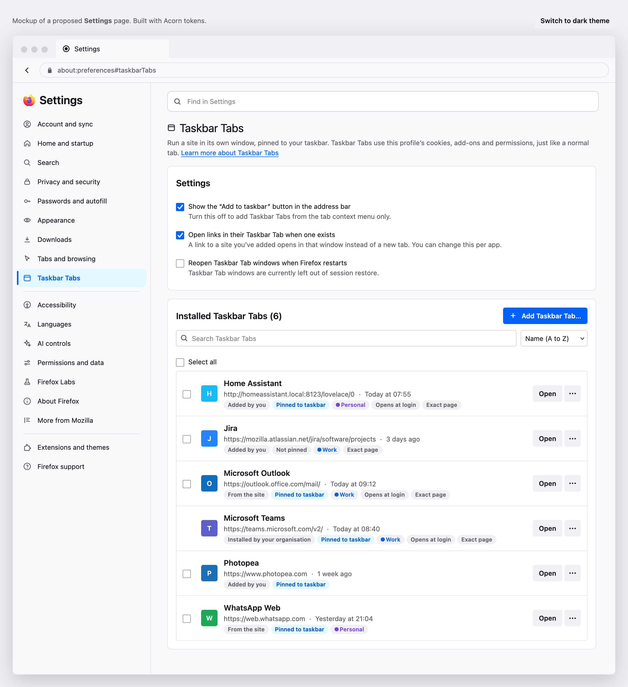
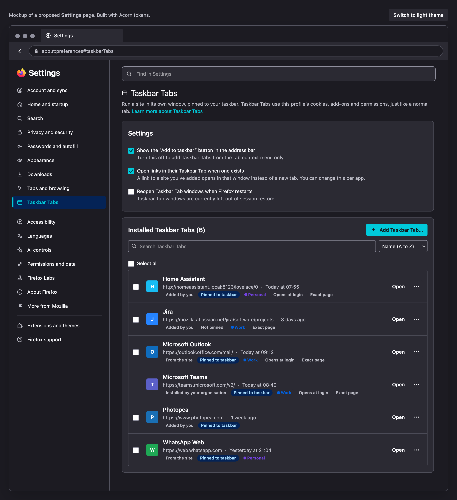
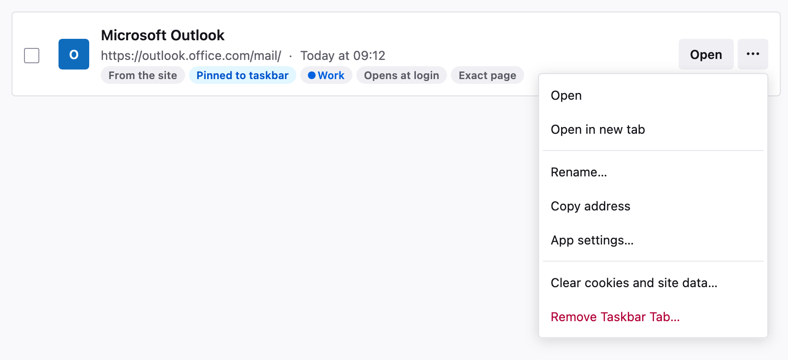
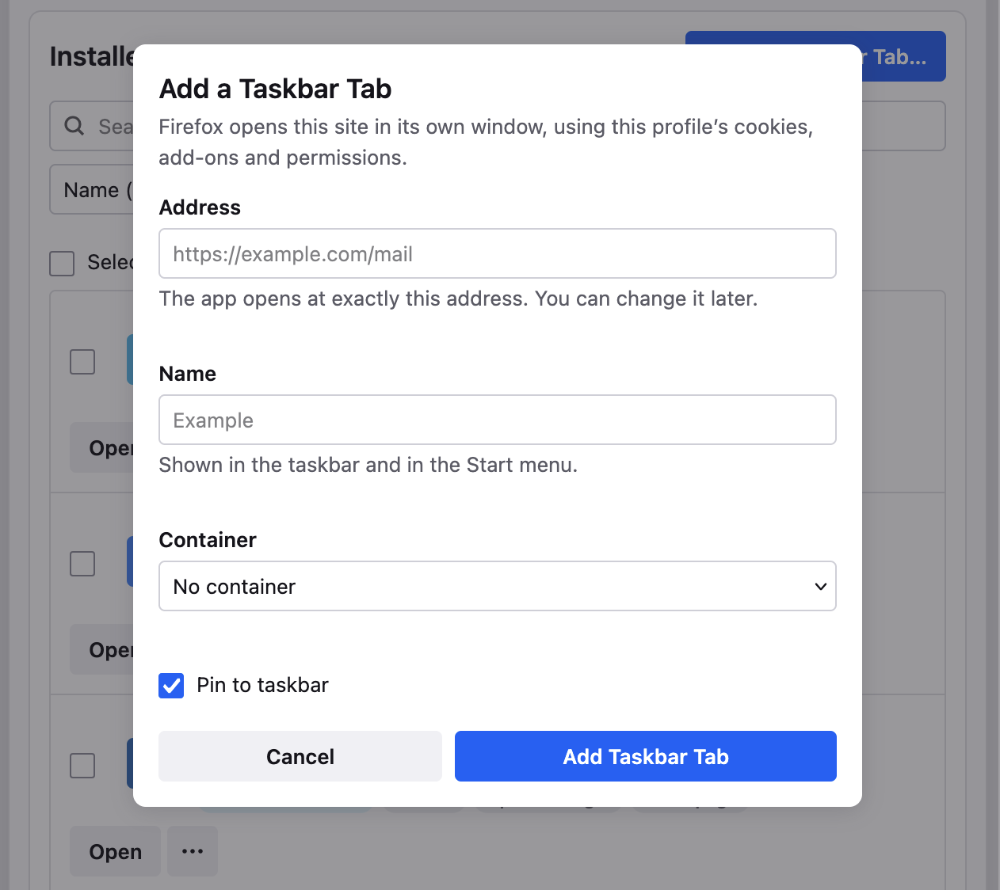
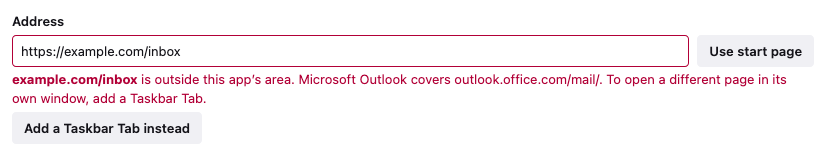
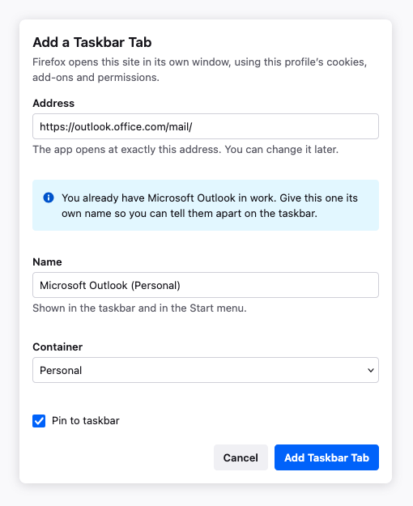
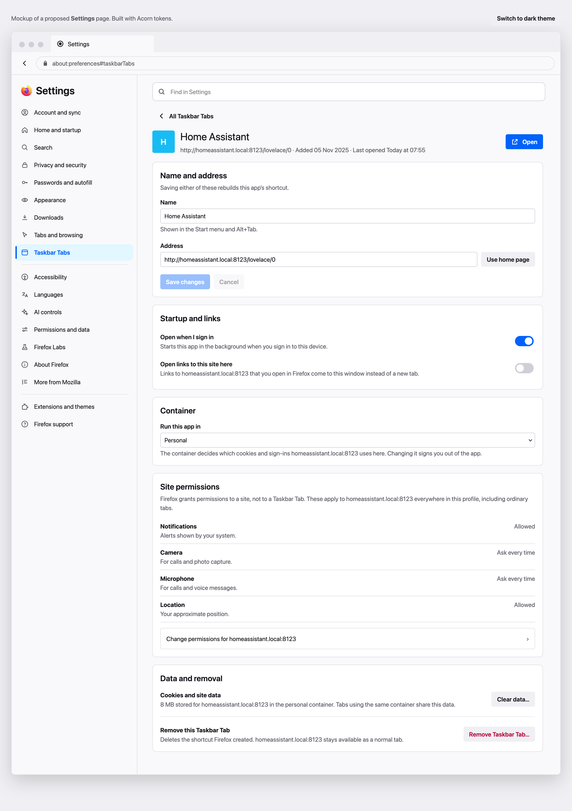
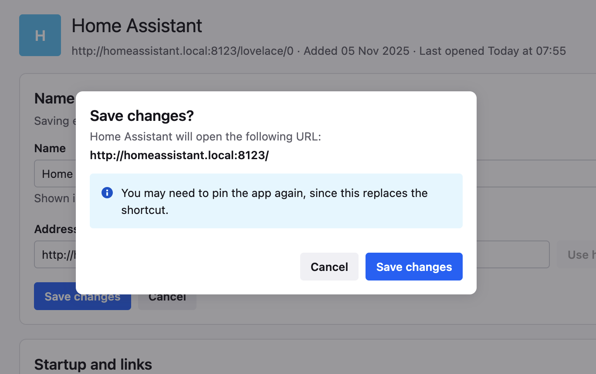
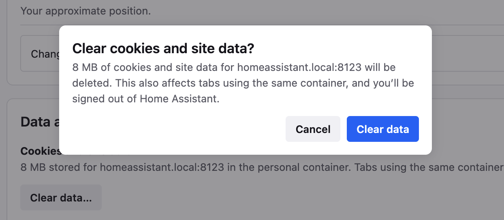
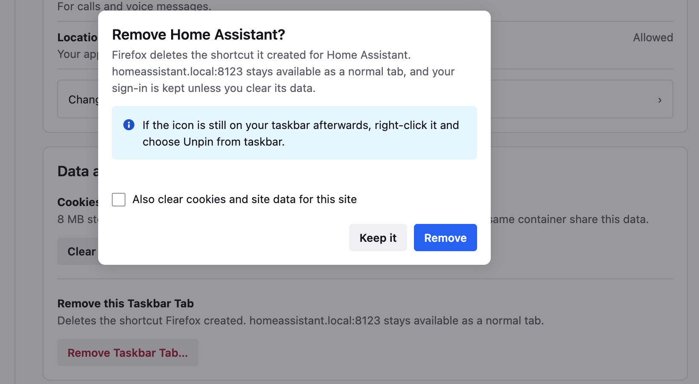

# Firefox Taskbar Tabs: Settings UI Mockup

Firefox can turn a website into a **Taskbar Tab**: its own window, its own icon, pinned to the taskbar. But once you've added a few, there's no way to manage them: no list, no rename, and no way to change the page one opens to.

This is a design prototype for that missing settings page, which sits in Firefox's redesigned Settings as its own sidebar item directly below Tabs and browsing.

## What's here

| File | What it is |
| --- | --- |
| [mockup.html](mockup.html) | The interactive prototype. Open it in any browser (no build step, no dependencies). |
| [taskbar-tabs-options-specification.md](taskbar-tabs-options-specification.md) | Every option, what each state does, and how it behaves at the edges. |
| [taskbar-tabs-design-rationale.md](taskbar-tabs-design-rationale.md) | Why each decision was made the way it was. |
| [taskbar-tabs-provenance-analysis.md](taskbar-tabs-provenance-analysis.md) | The long form of one decision: how the interface distinguishes an app the site declares from a shortcut you made, audited against Nielsen's ten heuristics. |
| [taskbar-tabs-security-analysis.md](taskbar-tabs-security-analysis.md) | What this design still has to answer, measured against what Chromium ships for installed web apps. |

## The main page

Three global preferences sit up top, and below them every Taskbar Tab you've added, each row showing its address, when it was last opened, and badges for whether it's pinned, which container it uses, and whether it opens at login. Search, sort and multi-select handle the case where the list gets long.



The same page in dark theme, which costs nothing extra because every colour comes from an Acorn token.



Per-row actions live in an overflow menu: open it, rename it, copy its address, or jump to its full settings.



Adding one asks for just an address, a name, and a container.



## Apps the site declares, and shortcuts you made

Two kinds of thing end up in this list. Most are shortcuts: you picked the address and the name. Some are apps the site declares in a manifest, where the name, icon, start page and scope belong to the developer, and where the name can change under you when the site is updated.

A third kind exists on a managed device: apps installed by policy, which take their identity from a manifest the same way but are not yours to remove.

They share one list, because someone looking for Teams should not have to know how Teams got there. The difference shows as a badge, and it decides what you can edit: the name is always yours to change, with the site's name shown beneath it and a reset beside it, while the address is held to the area the app declares.

An address outside that area is refused with the rule and a way out, rather than a field that will not accept typing and never says why.



Because containers can run one site twice, an app can exist once per container, and the second copy has to be named. Two identical icons on the taskbar where one holds your work account is the thing this avoids.



The reasoning, and the audit against Nielsen's ten heuristics, is in [taskbar-tabs-provenance-analysis.md](taskbar-tabs-provenance-analysis.md). What the design still owed after that, measured against Chromium, is in [taskbar-tabs-security-analysis.md](taskbar-tabs-security-analysis.md).

## The per-app page

Each app gets its own sub-page: rename it, change the address it opens to, choose whether it starts at sign-in and captures links, set its container, review site permissions, and clear its data or remove it.



## Confirmations that say what will actually happen

Anything with a side effect explains that side effect before you commit to it.

Changing the name or address rebuilds the shortcut, so the dialog shows the exact URL the app will open and warns that you may need to pin it again.



Clearing data spells out how much is stored, that other tabs in the same container are affected, and that you'll be signed out.



Removing an app is kept separate from clearing its data, so the site stays available as a normal tab unless you opt in to deleting its cookies.



## Try it

```
open mockup.html
```

Everything is clickable, because the prototype holds its own state: add apps, edit them, undo removals, and switch between light and dark themes. The layout also adapts down to narrow windows.

## Status

A prototype, not shipping code. Windows desktop is the target, with Linux following where supported and macOS not covered at all.

## License

Mozilla Public License 2.0. The full text is in [LICENSE](LICENSE).
