# Taskbar Tabs Management: Options Specification

This document gives each configurable option in the interface, the function of each of its states, and its behaviour in unusual conditions.

**Location:** Settings → Taskbar Tabs (`about:preferences#taskbarTabs`). It is its own item in the sidebar, directly below Tabs and browsing.
**Platform:** Windows desktop. Linux behaviour follows where Firefox gives support. This document does not include macOS.

---

## 1. Global settings

The Settings card holds three checkboxes. All three apply to all of Firefox, for the current profile.

### 1.1 Show the "Add to taskbar" button in the address bar

| | |
|---|---|
| **Control** | Checkbox |
| **Default** | On |

| State | Behaviour |
|---|---|
| **On** | The "Add to taskbar" icon shows at the right of the address bar on each applicable page. When you click it, Firefox adds the current tab as a Taskbar Tab. On a site that supplies an app (§9), the button reads **Install {name}**. |
| **Off** | The icon is hidden. You can add Taskbar Tabs from the tab context menu and from the **Add Taskbar Tab…** button on this page. |

**This is the only location that can install an app.** The **Add Taskbar Tab…** button makes shortcuts and never installs an app. An installation needs the manifest, and this is the one entry point where the browser already has the page (§5.1). Thus, if you turn the button off, you remove the installation path. §4.11 is then the method to install an app: add a shortcut, then change it to the app.

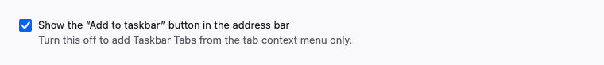

If you turn this off, Firefox never removes an existing Taskbar Tab, and never prevents new Taskbar Tabs. It only hides one entry point.

---

### 1.2 Open links in their Taskbar Tab when one exists

| | |
|---|---|
| **Control** | Checkbox |
| **Default** | On |

| State | Behaviour |
|---|---|
| **On** | Link capture is available. A link to a site that you added opens in the window of that tab and not in a new browser tab. This applies to each app that has its own switch on. |
| **Off** | Link capture is off in all locations. Each link opens in a usual browser tab, independent of the setting for each app. |

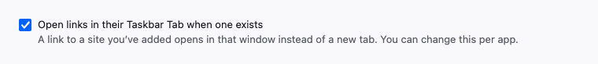

**Effect on the switch for each app:** this checkbox is the master control for §4.7. When it is off, the "Open links to this site here" toggle of each app is disabled and shows the message *"Turn on 'Open links in their Taskbar Tab' in Taskbar Tabs settings to use this."* Firefox keeps the value for each app and does not erase it. The values operate again when you turn this checkbox on.

**New tabs** take this setting as the initial value of their own switch.

---

### 1.3 Reopen Taskbar Tab windows when Firefox restarts

| | |
|---|---|
| **Control** | Checkbox |
| **Default** | Off |

| State | Behaviour |
|---|---|
| **On** | Session restore includes Taskbar Tab windows. They come back when Firefox restarts. |
| **Off** | Session restore does not include Taskbar Tab windows. This is the current Firefox behaviour. Usual tabs and windows are the same in both states. |

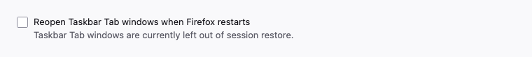

This checkbox does not control the start at sign-in. Each app has its own control for that (§4.6).

---

### 1.4 Restore defaults

| | |
|---|---|
| **Control** | Button, on the heading row of the Settings card |
| **Visibility** | Hidden while the three checkboxes are at their defaults. Visible as soon as one checkbox is different. |

| Action | Result |
|---|---|
| **Click** | Sets §1.1 to On, §1.2 to On, and §1.3 to Off. Shows the toast *"Taskbar Tab settings restored to defaults"*. The button then hides itself. |

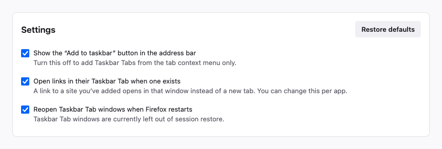

*The image shows §1.3 at a value that is different from its default. This makes the button visible.*

**Extent:** only the three checkboxes above the button. The button does not change an individual Taskbar Tab, its container, its address, its permissions, or its data.

While the button is hidden, it keeps its space. Thus no other control moves. The tab order and screen readers do not include the hidden button.

---

## 2. List controls

### 2.1 Search

| | |
|---|---|
| **Control** | Search field |
| **Default** | Empty |

The search field filters the list while you type. It compares the text with the name of the tab, its address, and the name that the site supplies (§9). It ignores case.

The comparison with the name from the site is important. A person searches for "Outlook" although the app now has the name "Work Mail".

| Condition | Result |
|---|---|
| **Empty** | The list shows each Taskbar Tab. |
| **Matches found** | The list shows only the rows that match. It keeps the sort order. |
| **No matches** | Empty state: *"No Taskbar Tabs match "…""* with a **Clear search** button. |

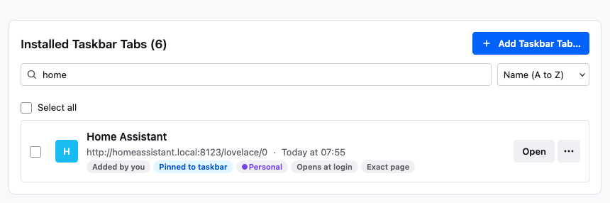

*A search for `home`, with one row that matches.*

A change to the search text clears the current selection.

---

### 2.2 Sort by

| | |
|---|---|
| **Control** | Dropdown |
| **Default** | Name (A to Z) |

| Option | Order |
|---|---|
| **Name (A to Z)** | Alphabetical, by the name on the display. |
| **Recently used** | The most recent tab first. |
| **Recently added** | The most recent addition first. |
| **Data stored** | The largest quantity of data first. |

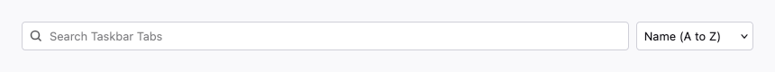

The sort order changes only the display. It has no effect on the order of the taskbar, which Windows controls.

---

### 2.3 Select all and row selection

| | |
|---|---|
| **Control** | One checkbox above the list, and one checkbox in each row |
| **Default** | Nothing selected |

| State | Behaviour |
|---|---|
| **Nothing selected** | The page shows the "Select all" checkbox. |
| **One or more selected** | The bulk action bar replaces "Select all". The bar reads *"N selected"* and holds **Remove** and **Cancel**. |

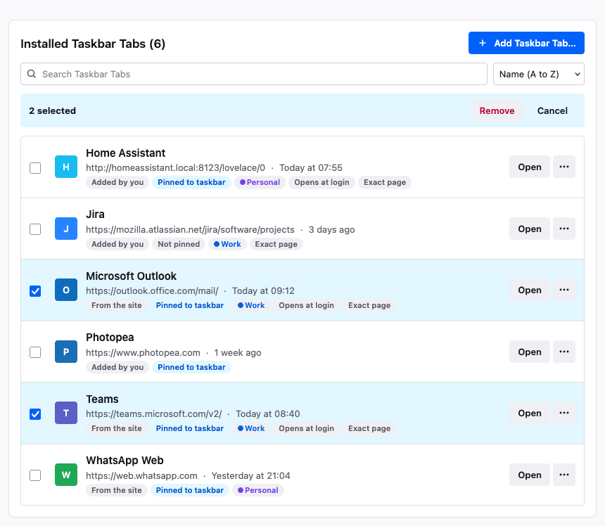

*Two rows are selected. The bulk action bar is in the position of the "Select all" checkbox.*

**Select all** applies to the *visible* rows. Thus, if a search is active, it selects only the filtered set. If each visible row is already selected, a click clears the selection.

These three operations clear the selection: Cancel, a change to the search text, and the completion of a removal.

---

### 2.4 Bulk Remove

| | |
|---|---|
| **Control** | Button in the bulk action bar |

The button opens the remove confirmation (§5.4) for each selected tab together. There is no bulk unpin control (see §6).

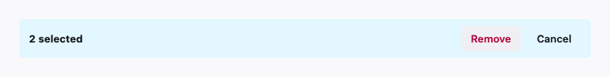

---

## 3. Row actions

Each row has an **Open** button and an overflow (⋯) menu.

| Item | Availability | Behaviour |
|---|---|---|
| **Open** | Always | Starts the tab in its own window at its configured address. |
| **Open in new tab** | Always | Opens the same address as a usual browser tab, in the container of the tab. |
| **Pin to taskbar** | Only when the tab is **not** pinned | Asks Windows to add the icon to the taskbar. |
| **Rename…** | Always | Opens the app settings page, puts the focus in the Name field, and selects its text. |
| **Copy address** | Always | Copies the full address of the tab to the clipboard. |
| **App settings…** | Always | Opens the app settings page. |
| **Clear cookies and site data…** | Always | Opens the confirmation that deletes the data (§5.5). |
| **Remove Taskbar Tab…** | Always | Opens the remove confirmation (§5.4). |

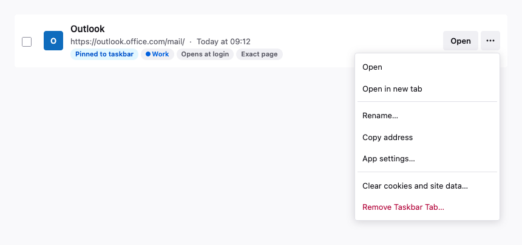

There is intentionally **no unpin item**. See §6.

### 3.1 Row badges (read-only)

| Badge | Meaning |
|---|---|
| **From the site** | The name, the icon, and the start page of the app come from the site (§9). |
| **Added by you** | The person selected the address and the name, and not the site. |
| **Installed by {authority}** | A policy installed the app. The identity comes from the manifest, as above, but the removal rules are different (§4.10). |
| **Pinned to taskbar** | The icon is on the taskbar now. |
| **Not pinned** | The tab exists, but it has no icon on the taskbar. |
| *Container name* and a colour dot | The container that the tab runs in. The badge is absent when the tab has no container. |
| **Opens at login** | "Open when I sign in" is on for this tab. |
| **Exact page** | The address includes a path. Thus the tab opens a specific page and not the home page of the site. |

These badges are labels, and not controls.

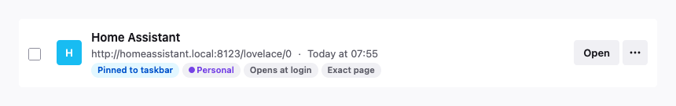

---

## 4. Settings for each app

You open this page when you click the name of a tab, **App settings…**, or **Rename…**.

If the identity of a tab comes from the site (§9), the header has one more line:
*"This app is provided by {host}, which sets its name, icon and start page. You can rename it here for yourself."*
No other part of the page changes.

### 4.1 Name

| | |
|---|---|
| **Control** | Text field, part of the Name and address form |
| **Default** | The name at the time of the addition, or the name from the site |
| **Validation** | The field cannot be empty |

This field sets the name in the Start menu, in Alt+Tab, and on this page. It does not change the site.

Firefox keeps the changes until you click **Save changes** (§4.4). If you submit an empty name, the field takes the focus and shows *"Give the app a name so you can find it in the Start menu"*.

**The field is editable for both types.** The name is a private label. Firefox never transmits it, never uses it in a decision about an origin, and never uses it as a security boundary. Thus a local name can replace a name from the site.

| Element | Condition |
|---|---|
| *"The site calls this app "{site name}"."* at the end of the field description | The tab came from the site |
| **Use the name from the site** button | The current name is different from the name of the site |

The name of the site stays visible in both conditions. Thus the claim of the developer is always legible.

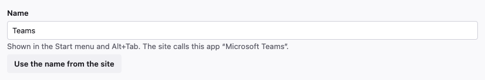

---

### 4.2 Address

| | |
|---|---|
| **Control** | Text field, part of the Name and address form |
| **Default** | The address at the time of the addition |
| **Validation** | The text must give a valid `http://` or `https://` URL |

This is the address that the tab opens. A host alone (`example.com`) opens the home page of the site. A full address (`example.com/mail/inbox`) opens that page. Thus two pages on one site can become two separate Taskbar Tabs.

| Input | Result at the save operation |
|---|---|
| **Full URL** | Firefox uses the text as you typed it, in its normal form. |
| **No scheme** | Firefox adds `https://` automatically. |
| **Not a URL** | Firefox stops the save operation. The field becomes invalid and a message gives the correct format. |

Firefox calculates the **Exact page** badge from this field. There is no separate switch.

**The field is constrained for a tab that came from the site.** The field stays editable, but the address must stay in the area that the app declares. The field shows no permanent description about that area. The interface gives the rule only when a person breaks it, in the validation message below. A permanent line would repeat the message and would add text to a field that is correct in almost all conditions.

| Input | Result at the save operation |
|---|---|
| **In the area** | Firefox saves the address. You can open the app at `/mail/calendar` and not at `/mail/inbox`. |
| **Outside the area** | Firefox refuses the address. The field becomes invalid and shows *"`example.com/inbox` is outside this app's area. {name} covers `outlook.office.com/mail/`. To open a different page in its own window, add a Taskbar Tab."* An **Add a Taskbar Tab instead** button is below the message. The button opens §5.1 with the text that you typed. |

The field has validation and is not disabled. A disabled field says only "you cannot". A field with validation gives the rule at the moment that the rule is important, and keeps an alternative available.

There is **no advanced override**. You can satisfy each correct need if you edit the address in the area or add a separate Taskbar Tab. An override would add only the condition where an app keeps its name and its icon but points to a different location.

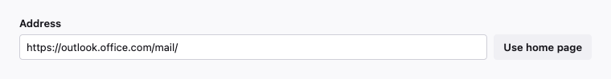

*The Address field of an app from the site. The area of the app is not on the page until a person breaks the rule.*

*The message gives the text that you typed, the rule, and the alternative.*

---

### 4.3 Use home page / Use start page

| | |
|---|---|
| **Control** | Button adjacent to the Address field |
| **Label** | **Use home page** for a tab that you added. **Use start page** for a tab from the site. |

| Type | Enabled when | Result |
|---|---|---|
| **Added by you** | The address includes a path | Removes the path and keeps the origin |
| **From the site** | The address is different from the start page of the app | Sets the address to the start page that the app declares |

The button changes only the draft. You must still save the change.

A tooltip shows at hover and at focus, and gives the target: *"Shortens the address to just outlook.office.com. Keep a full address to give one page its own Taskbar Tab."*, or *"Resets the address to https://outlook.office.com/mail/, the start page this app declares."*

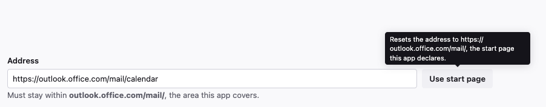

---

### 4.4 Save changes and Cancel

| | |
|---|---|
| **Controls** | Two buttons below the Name and address fields |
| **Enabled when** | One field or both fields are different from the saved value |
| **Disabled when** | Nothing changed |

| Action | Result |
|---|---|
| **Save changes** (the tab is **not** pinned) | Firefox applies the changes immediately. Toast: *"Changes saved for {name}"*. |
| **Save changes** (the tab **is** pinned) | Firefox opens the save confirmation (§5.2) first. |
| **Cancel** | Firefox discards the two edits and puts back the saved values. |

If you go off the page, Firefox also discards the edits that you did not save.

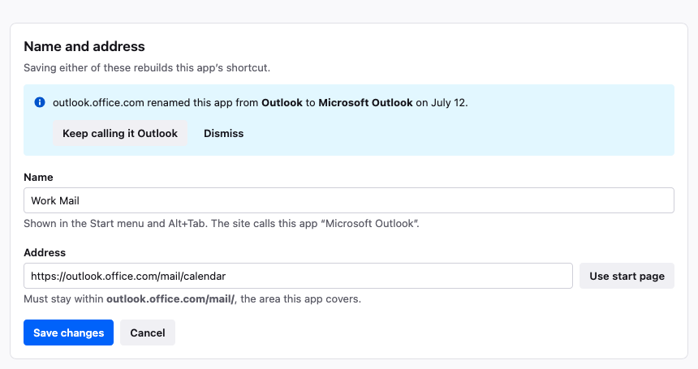

*The two buttons become enabled only when a field is different from the saved value.*

---

### 4.5 Container

| | |
|---|---|
| **Control** | Dropdown |
| **Default** | The container at the time of the creation of the tab |
| **Options** | No container, Work, Personal, Banking, Shopping (the containers of the profile) |

The container controls which cookies and which sign-ins the tab uses.

| Action | Result |
|---|---|
| **Select a different container** | Firefox opens the confirmation for the container change (§5.3) immediately. |
| **Confirm** | Firefox applies the container. The quantity of data in storage becomes zero, and a toast offers **Undo**. |
| **Cancel, Escape, or a click outside** | The dropdown goes back to its previous value. Nothing changes. |

The change applies immediately at the confirmation. Thus it is not part of the Save changes form.

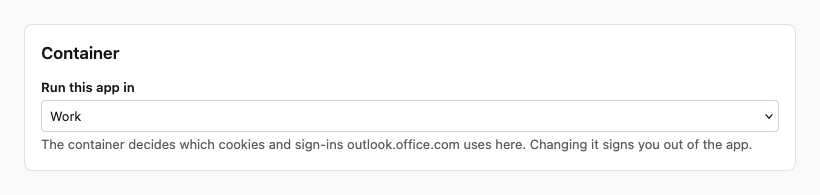

---

### 4.6 Open when I sign in

| | |
|---|---|
| **Control** | Toggle |
| **Default** | Off for a new tab |

| State | Behaviour |
|---|---|
| **On** | The tab starts automatically when you sign in to the device. |
| **Off** | The tab starts only when you open it. |

This toggle is independent of §1.3, which controls a Firefox restart and not a device sign-in.

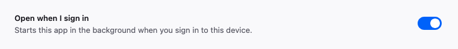

---

### 4.7 Open links to this app here

| | |
|---|---|
| **Control** | Toggle |
| **Default** | The value of §1.2 at the time of the addition. A second copy in a different container starts off. |
| **Disabled when** | §1.2 is off |

| State | Behaviour |
|---|---|
| **On** | A link that is in the area of this app, and that you open in Firefox, comes to this window and not to a new tab. |
| **Off** | These links open as usual tabs. |
| **Disabled** | The interface shows *"Turn on 'Open links in their Taskbar Tab' in Taskbar Tabs settings to use this."* Firefox keeps the value in storage. |

**The area of the app** depends on the source of the tab (§9):

| Type | Area | Reason |
|---|---|---|
| **From the site** | The declared area, for example `outlook.office.com/mail/` | The site declared its extent. Thus the app claims nothing more. |
| **Added by you** | The full host | A shortcut declares nothing. Thus the host is the only available rule. |

A comparison by host is the more coarse of the two rules. On a shared host, it captures the pages of other persons. The description gives this information: *"A shortcut has no declared area, so this covers the whole site."*

**Only one copy can capture links.** If not, two copies of one app in different containers claim the same link, but a link has one destination. When you turn this toggle on, Firefox releases the capture from the other copy. The description gives the name of the copy that holds the capture now: *"Microsoft Outlook in work opens these links today. Turning this on moves them here."* A toast confirms the change.

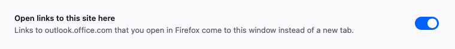

*The image shows the enabled state. When §1.2 is off, the toggle becomes grey and the description changes.*

---

### 4.8 Site permissions (read-only)

The card has four rows (Notifications, Camera, Microphone, Location). Each row shows **Allowed**, **Ask every time**, or **Blocked**.

**These values are not editable here, and that is intentional.** Firefox gives permissions to a site, and not to a Taskbar Tab. Thus these values apply to the host in all locations in the profile, and this includes usual tabs. The page gives this information clearly.

The **Change permissions for {host}** link goes to the site permissions, where the interface shows the change at its true extent.

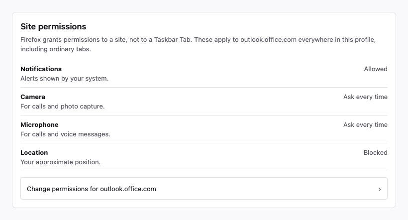

---

### 4.9 Clear data

| | |
|---|---|
| **Control** | Button in Data and removal |

The row shows the quantity of data in storage for the host in the container of this tab. It also gives the information that tabs in the same container share that data. The button opens the confirmation that deletes the data (§5.5).

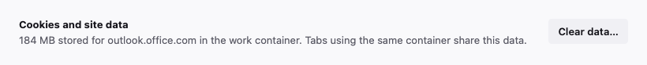

---

### 4.10 Remove Taskbar Tab

| | |
|---|---|
| **Control** | Button in Data and removal |
| **Absent when** | A policy installed the tab (§9) |

The button opens the remove confirmation (§5.4).

The text is the same for both types. Firefox removes the Taskbar Tab. It does not uninstall the site, and the site stays available in a usual tab. The dialog already gives this information.

**For a managed tab, the button is absent and not disabled.** The row gives the name of the authority instead: *"Your organisation installed Microsoft Teams and manages whether it can be removed."* A disabled button with no explanation is the dead end that §4.2 refuses. The name of the authority answers the question that the button would cause. The selection controls also do not include a managed tab (§2.3), because removal is the only bulk action.

Today, the removal deletes the shortcut and no more. If Firefox registers file handlers or protocol handlers from a manifest (§9), this section and §5.4 must give each item that the removal deletes. If not, the text becomes untrue.

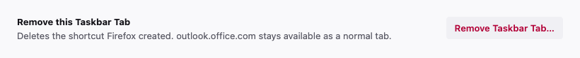

---

### 4.11 This site provides an app

| | |
|---|---|
| **Control** | Information bar at the top of the Name and address card |
| **Shown when** | A person added the tab manually, and the site supplies an app |

The bar reads *"**This site provides an app.** {host} offers {name} with its own name, icon and start page. Switching keeps your container, startup and link settings."*

| Action | Result |
|---|---|
| **Switch to the app…** | Firefox takes the name, the icon, the start page, and the area from the site. It makes the shortcut again. Thus a pinned tab gets the save confirmation (§5.2) first. Firefox keeps a name that the person selected, and that name becomes a local override. |
| **Not now** | Firefox hides the bar for this tab. |

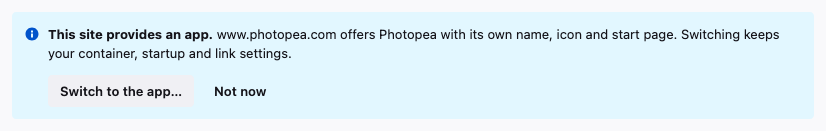

---

### 4.12 Renamed by the site

This is the one value on this page that can change without an action by the person.

| Condition | Behaviour |
|---|---|
| A local name exists | Firefox keeps the local name. The new name from the site shows in the field description and in no other location. |
| No local name exists | Firefox takes the new name and makes the shortcut again. |

Firefox never takes the new name silently. An information bar stays at the top of the Name and address card until you dismiss it: *"{host} renamed this app from **{old}** to **{new}** on {date}."*

The date reads **July 12** for a change in the current year, and **July 12, 2025** for a change in an earlier year. Thus the year uses space only when it is not the obvious year.

| Action | Result |
|---|---|
| **Keep calling it {old}** | Firefox writes {old} as a local name, with the same mechanism as a manual rename, and hides the bar. |
| **Dismiss** | Firefox keeps the new name and hides the bar. |

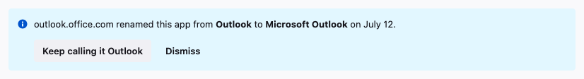

---

## 5. Dialogs

### 5.1 Add a Taskbar Tab

The **Add Taskbar Tab…** button opens this dialog.

| Field | Default | Notes |
|---|---|---|
| **Address** | Empty, necessary | The tab opens at exactly this address. Invalid text stops the submission and shows an inline error. |
| **Name** | Empty | If the field is empty, Firefox uses the host and removes an initial `www.`. |
| **Container** | No container | You set the container one time, here. |
| **Pin to taskbar** | Selected | Firefox asks Windows to add the icon. |

**This dialog makes only shortcuts.** It never makes an app whose identity comes from a manifest, and it never requests the address that you typed.

The reason is the entry point. An installation from here would cause the Settings page to send a request to an arbitrary address, possibly an address that you copied, before you agreed to anything. That is a request that the person did not ask for, to a server that the person can be unfamiliar with. Thus the installation occurs from the address bar (§1.1), where the browser already has the page and its manifest, because the person selected to visit the site. If a shortcut points at a site that supplies an app, its own settings page offers the change (§4.11). That offer also needs no speculative request.

Each entry point does one task, and neither entry point must guess.

**Firefox finds duplicates at the submission.** The check includes the container, because containers exist to run one site two times:

| Case | Result |
|---|---|
| **Same address, same container** | Firefox refuses the addition. *"{name} already opens this address in the same container. Open it from the list, or choose a different page."* |
| **Same address, different container** | Firefox permits the addition. The dialog gives this information before the submission, because two copies share a name and an icon, and the taskbar shows neither the container nor this list. |
| **Same address, different container, same name** | Firefox refuses the addition at the Name field. *"{name} is already the name of this app in {container}. Give this one a different name."* |

For the permitted case, an information bar shows: *"You already have Microsoft Outlook in work. Give this one its own name so you can tell them apart on the taskbar."* The Name field has a suggestion, `Microsoft Outlook (Personal)`, or `Microsoft Outlook (2)` when the new copy has no container. The suggestion follows the container while the container changes. Firefox removes the suggestion if the address becomes different. But Firefox never replaces a name that you typed.

A second copy also starts with link capture off (§4.7), because only one copy can hold the capture.

After a correct addition, Firefox puts the tab at the top of the list. A toast confirms the addition and offers **Open**.

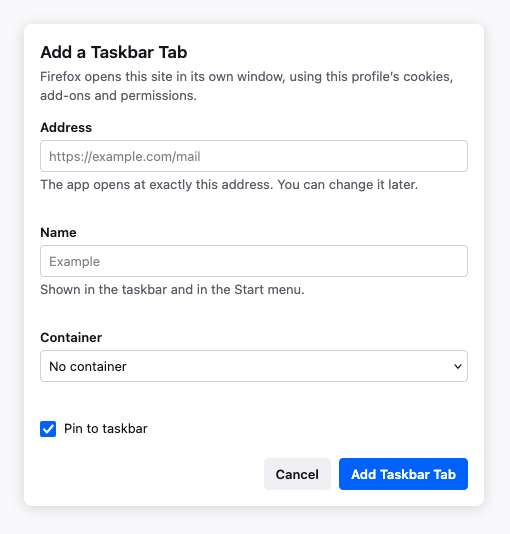

*A second copy of an app that already exists in a different container.*

---

### 5.2 Save changes?

Firefox shows this dialog only when you save the name or the address of a **pinned** tab.

| Element | Condition |
|---|---|
| *"{old name} will be renamed to {new name}."* | The name changed |
| *"{new name} will open the following URL:"* and the URL in bold | The address changed |
| Information bar: *"You may need to pin the app again, since this replaces the shortcut."* | Always, in this dialog |

| Action | Result |
|---|---|
| **Save changes** | Firefox applies the two edits. |
| **Cancel or Escape** | Firefox goes back to the form and keeps the edits. |

The dialog shows the URL in its normal form, which is the form that Firefox writes to the shortcut.

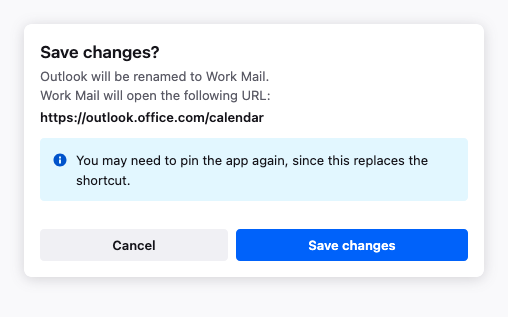

*The image shows a change to the name and a change to the address.*

---

### 5.3 Change container?

| Element | Content |
|---|---|
| **Title** | *"Move {name} to {container}?"*, or *"Stop using a container for {name}?"* when you move the tab to no container |
| **Body** | *"{name} will use the {container} container's cookies and sign-ins for {host}, so you may be signed out of the app."* |
| **Information bar** | Shown only when the tab is pinned: *"You may need to pin the app again, since this replaces the shortcut."* |

| Action | Result |
|---|---|
| **Move to {container}** | Firefox applies the change. The quantity of data in storage becomes zero. A toast offers **Undo**. |
| **Cancel, Escape, or a click outside** | Firefox puts the dropdown back to its previous value. |

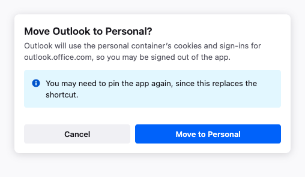

---

### 5.4 Remove Taskbar Tab?

| Element | Content |
|---|---|
| **Title** | *"Remove {name}?"* or *"Remove {n} Taskbar Tabs?"* |
| **Body** | Tells the person that Firefox deletes the shortcut that it made, that the site stays available as a usual tab, and that the sign-in stays until the person deletes the data. |
| **Checkbox** | *"Also clear cookies and site data for this site"*, off by default |
| **Information bar** | Shown when one or more of the tabs is pinned: *"If the icon is still on your taskbar afterwards, right-click it and choose Unpin from taskbar."* |

| Action | Result |
|---|---|
| **Remove** | Firefox removes the tab or the tabs. A toast offers **Undo**, which puts them back at their original positions in the list. |
| **Keep it or Escape** | Nothing changes. |

If you remove the tab that you look at now, Firefox goes back to the list.

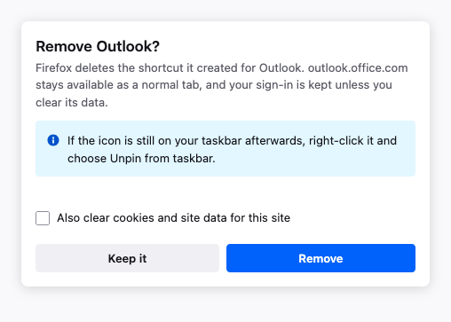

---

### 5.5 Clear cookies and site data?

The body gives the quantity of data and the host. It also warns that the operation affects tabs in the same container, and that the site will sign you out.

| Action | Result |
|---|---|
| **Clear data** | The quantity of data in storage becomes zero. A toast confirms the operation. **You cannot undo this operation.** |
| **Cancel or Escape** | Nothing changes. |

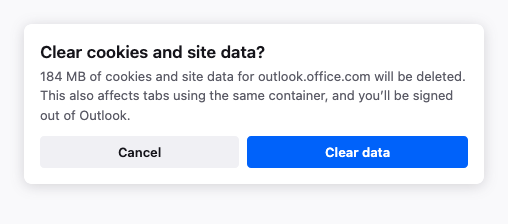

---

## 6. Taskbar pin operations: what is possible and what is not possible

Windows controls the taskbar, and the browser does not. Firefox can ask Windows to add an icon. It cannot remove an icon.

| Capability | Available | Location |
|---|---|---|
| Add an icon to the taskbar | Yes | Add dialog, and **Pin to taskbar** in the row menu |
| See if a tab is pinned | Yes | Row badge |
| Remove an icon from the taskbar | **No** | Click the icon on the taskbar with the right button, then select **Unpin from taskbar** |
| Bulk unpin | **No** | Not applicable |

Thus there is no pin toggle, no unpin menu item, and no bulk unpin control. The interface warns in the two locations where an operation can affect a pin: when you save the name or the address of a pinned tab, and when you remove a pinned tab.

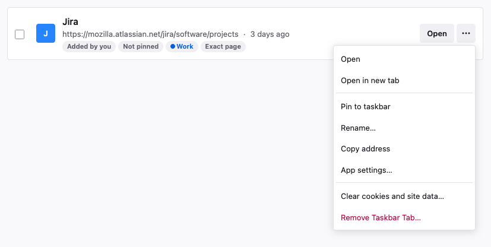

*The menu of a tab that is not pinned offers **Pin to taskbar**. There is no unpin action in the interface.*

---

## 7. Feedback and undo

Toasts show at the bottom of the window. They go away automatically after about eight seconds, and you can also dismiss them manually.

| Action | Undo available |
|---|---|
| Remove (one tab or a bulk removal) | Yes. Firefox puts the tabs back at their original positions in the list. |
| Change container | Yes. Firefox puts back the container and the quantity of data in storage. |
| Add a Taskbar Tab | No, but the toast offers **Open**. |
| Save the name or the address | No, because the confirmation dialog is the checkpoint. |
| Change to the app that a site supplies | No, for the same reason. |
| Refuse a rename by the site | No, but the action only writes a name that you can change again. |
| Clear cookies and site data | No |
| Restore defaults | No |
| Pin to taskbar | No |

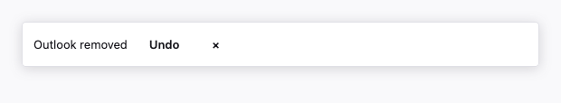

---

## 8. Page states

| State | Trigger | Content |
|---|---|---|
| **Normal** | One or more Taskbar Tabs exist | The Settings card and the full list |
| **Empty** | No Taskbar Tabs exist | The Settings card, an empty state that tells you how to add a tab, and an **Add Taskbar Tab…** button |
| **No search results** | The search text matches nothing | The message and a **Clear search** button. The remainder of the list is unchanged. |
| **Selection active** | One or more rows are selected | The bulk action bar replaces the "Select all" checkbox |
| **App settings** | You open a tab | A sub-page with an **All Taskbar Tabs** button that goes back. There are no breadcrumbs, as in the remainder of Settings. |

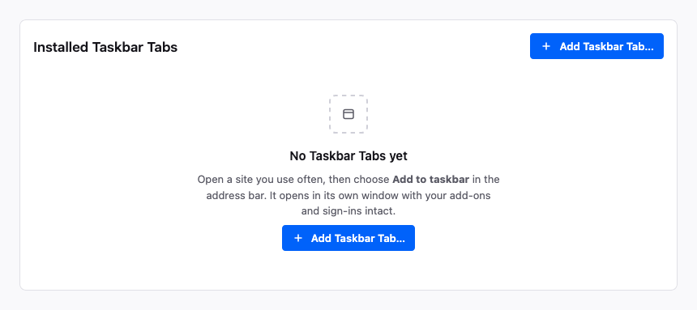

*The page in this state when no Taskbar Tabs exist.*

---

## 9. The source of each value

Three types of entry share the list. A person typed the first type manually. The site declared the second type in a manifest, where the name, the icon, the start page, and the area belong to the developer. A policy installed the third type. The third type also takes its identity from a manifest, but the person cannot remove it.

| | Added by you | From the site | Installed by policy |
|---|---|---|---|
| **Name** | Yours | From the site. A local name can replace it (§4.1). | The same as From the site |
| **Address that it opens** | Any valid `http(s)` URL | The declared start page. Editable in the area of the app (§4.2). | The same |
| **Area that it covers** | Calculated: the host of the address | Declared by the site | The same |
| **Icon** | Favicon | From the site | The same |
| **Can change without a user action** | No | Yes: the name, when the site changes (§4.12) | Yes |
| **Can be removed** | Yes | Yes | No (§4.10) |

### The identity of an app is the manifest and the container

Chromium keys an installed app on its manifest `id` in a profile. The isolation unit in Firefox is inside the profile. Thus the same key would make two containers that run one app the same for each function downstream.

For this reason, the identity key is the manifest `id` **and** the container. This document already gives each consequence:

| Question | Answer |
|---|---|
| Can one app exist two times? | Yes, one time in each container (§5.1) |
| How can you tell the difference? | By name. The second copy must have a different name, because the taskbar shows neither the container nor this list. |
| Which copy captures a link? | Exactly one copy, and you select it explicitly (§4.7) |
| Which copy starts at sign-in? | One copy, both copies, or neither copy. Two windows at sign-in is a sensible thing to want (§4.6). |

### A manifest identity needs a secure context

Firefox takes the name, the icon, the start page, and the area of an app only from a manifest that comes over HTTPS. Each person on the network can edit a manifest that comes over plain HTTP. An identity is exactly the value that these persons must not edit.

A **shortcut** to an `http://` address stays permitted, because a device on your own network is a correct thing to address. `http://homeassistant.local:8123` is a true example. Settings gives no badge and no warning for this condition. The warning belongs in the window, where the risk is (§10), and not in a list of items that you configured intentionally.

### The area is a set, and not one origin

Firefox stores the area of an app as a list of matchers. Today the list always has one item. Chromium has `scope_extensions`, which lets an app claim more origins. Each of these origins must agree, and it agrees when it holds a file that gives the name of the app. Firefox can implement this function or not implement it. But the code must not compare one origin only. If it does, §4.2 refuses the second origin of a correct app that uses more than one origin.

The types share one list, and the list has no sections. A person who looks for Teams must not have to know how Teams came into the list. The difference is a property of a row, and a badge shows it (§3.1). The difference is not a method to group the page.

**The badge is not a trust signal.** The party that controls the origin asserts the manifest, and Firefox does no more verification. Thus **From the site** has no checkmark, no shield, and no "Verified" text.

### Why the name is editable and the address is not

The name is a private label with no security function. Also, the rename function is the function that equivalent features most frequently do not have. If you install one site in more than one profile, you get more than one icon with the same name. To lock the name would give no advantage.

The address is different. A window presents itself as an app, has the icon of the site, is on the taskbar, and holds the cookies and permissions of the site. Thus it makes a statement about what it is. If you can point it to a different location, that statement becomes untrue. Thus the address must stay in the area that the app declares. That area is the statement of the site about its own extent, and it is not a constraint that Firefox invented.

### Not built

- Two sections in the list, a Type column, or a filter for the source of an app.
- A hidden advanced override for the address (§4.2).
- Editable icons, for each type.
- A verified badge or a trusted badge.
- A separate "Uninstall" vocabulary (§4.10).
- A badge in the list for an insecure origin. The window carries that information (§10).
- **File handlers and protocol handlers.** Chromium writes the `file_handlers` and the `protocol_handlers` from a manifest into the Windows registry, and removes them at the uninstall operation. This design does not model them. A claim on `.pdf` or on a URL scheme is an assertion at the level of the operating system, and Firefox must truly make it. Also, a control for a function that the operating system ignores is the unpin toggle again (§6). If these members come later, §4.10 and §5.4 must give each item that the removal deletes. "Deletes the shortcut Firefox created" is then no longer the full truth.
- **Each manifest member that is not part of the identity**: `share_target`, `shortcuts`, `launch_handler`, badging, and widgets. None of them changes the content of this page.

---

## 10. The app window

The settings on this page make a window that has less chrome than a usual window. That window is not part of Settings. But it is the location where the identity rules in §9 operate or fail. Thus the rules for that window are in this document.

**The problem.** If you remove the address bar, you remove the primary anti-phishing control of the browser. The address constraint in §4.2 prevents a change to the address of a Taskbar Tab through Settings. It does nothing about an app that goes to a different location after it opens. That attack is less expensive, and it does not use Settings.

**The rule.** The window always shows the origin, in true window chrome that the content cannot draw over. The appearance of the origin changes when the app goes out of the area that it declares.

| State | Content |
|---|---|
| **In the area of the app** | A padlock and the origin, in the title bar adjacent to the name of the app |
| **Outside the area** | A warning icon, the new origin, and *"Outside {app name}"*, in the position of the calm state |
| **Not secure** | A warning icon and *"Not secure"* before the origin. This is the only location that gives this information for an `http://` shortcut (§9). |

Chromium shows nothing while the app stays in its area, and raises a small URL bar only when the app goes out of the area. That behaviour is one state better than nothing, and one state worse than this design. A page in standalone mode can draw a good copy of the indicator of the browser. An indicator that is usually absent is the easiest type to copy, because there is nothing to compare the copy with. An origin that is always present, always in the same location, and outside the content area is a much more difficult target.

This does not make a false window impossible. It makes the false window compete with a true control in a fixed position, and not fill an empty space.
